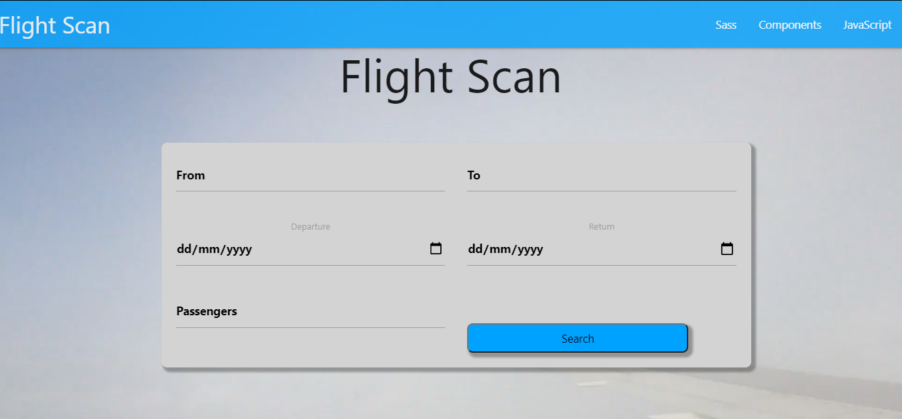

# Flight Search Page.

#### Introduction (what it's about & why you wrote it)
 The page was created for portfolio purposes.

#### How to install

first clone the repository then run `npm isntall`

### `npm start`

Runs the app in the development mode. 
Open [http://localhost:3000](http://localhost:3000) to view it in the browser.

The page will reload if you make edits. 
You will also see any lint errors in the console.

#### How to use
Search for flight prices by filling the form with your departure place, your destination, departure date, return date, and how many passengers.

#### Technologies used
Created with JavaScript, React.js Consuming from an API.

API: https://developers.amadeus.com/self-service/category/air

Made By Fabricio Cunha

